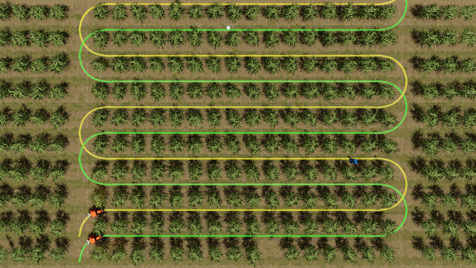
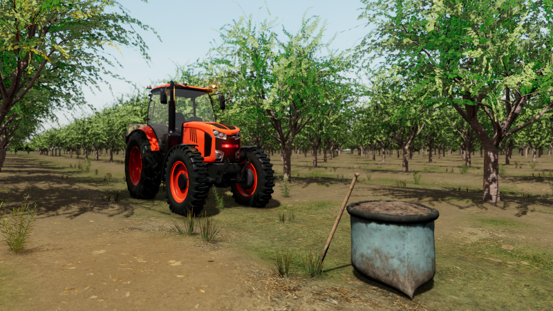
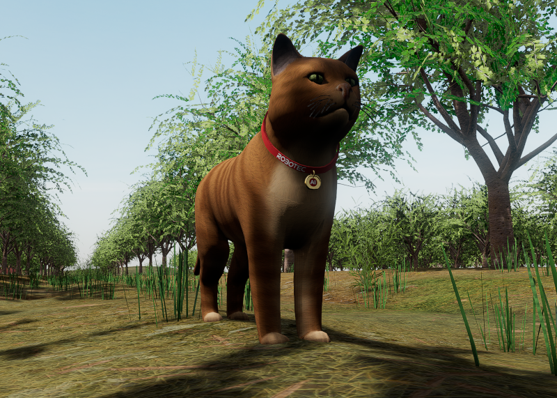

# Automatic Guided Vehicle Demo

This project demonstrates the use of [RAI](https://github.com/RobotecAI/rai) framework paired with [O3DE](https://www.o3de.org/) game engine for the agricultural simulation. In particular, it shows the communication between Generative AI models and tractors navigating between trees in the orchard.

> **_NOTE:_**  This repository is not yet functional, as the demo is undergoing an internal review and development. All screenshots in this _README_ file are generated using a working proof-of-concept implementation. The code will be fully usable and documented before [ROSCon 2024](https://roscon.ros.org/2024/).

## Demo description

The demonstration comprises a simulation of two autonomous tractors navigating along predefined trajectories within an orchard environment. Various obstacles are placed between tree rows, causing the tractors to stop and transmit requests for assistance via ROS 2 messaging protocols. The RAI framework intercepts these messages. Next, it integrates them with sensor and contextual information to subsequently trigger a predetermined action for each tractor based on the Generative's AI analysis.

There are four obstacles in total, including a compost bag, a set of barrels, fallen tree branches and a cat. Each tractor can continue cruising through the obstacle, reverse and replan the path or use a signal (light or sound).

### Screenshots

Birdview of the orchard with predefined trajectories of two tractors.

A tractor reaching one of the obstacles (a compost bag and a spade).

A tractor reaching one of the obstacles; view from the interior (a set of barrels).

A cat standing in the middle of the tractor's path.

### Sample conversation

The sample conversation between the AI Assistant and the tractor orchestrated by RAI framework can be found [here](docs/sample.md).

## Requirements

### Platforms
The project runs on Ubuntu 22.04 with ROS 2 Humble and on Ubuntu 24.04 with ROS 2 Jazzy.

> **Note:** This demo is **not supported on Windows!**

### Hardware
Minimum specs are not determined, but we successfully ran it on:
- NVIDIA GeForce RTX 3070 GPU (8 GB).
- Intel i7-11800H (16 cores) CPU.
- 64 GB RAM.

## Project setup

> **_NOTE:_** This section will be added in the final version of this document.

## Running the simulation

> **_NOTE:_** This section will be added in the final version of this document.